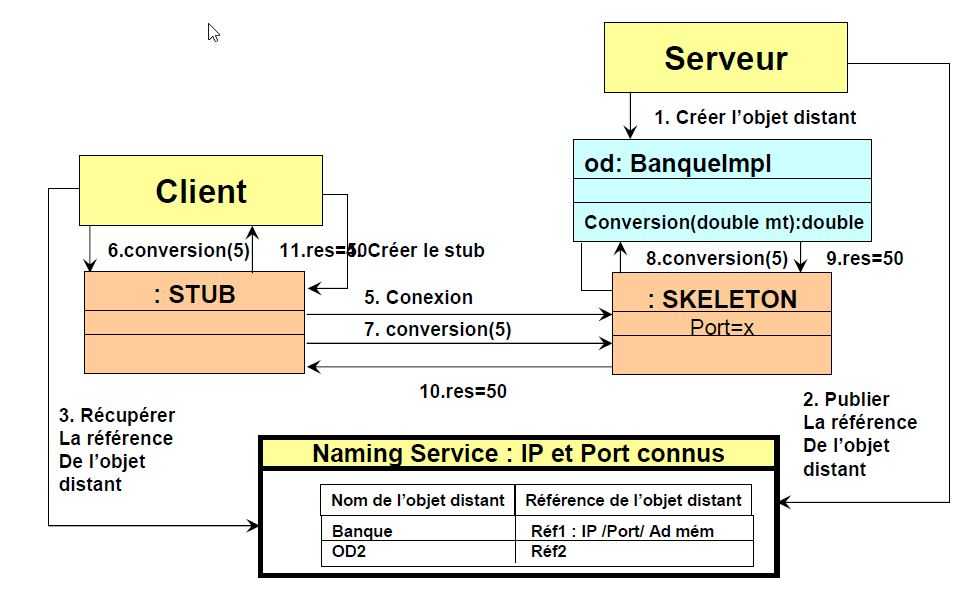
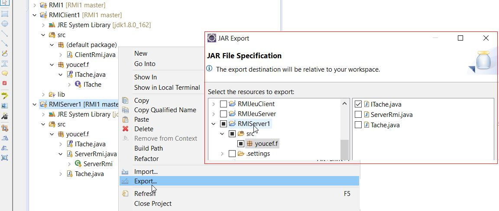
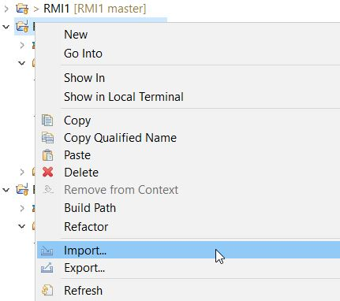

# RMI

## Architecture

- Les interfaces sont le coeur de RMI.
- L’architecture RMI est basé sur un principe important :
    - La définition du comportement et l’exécution de ce comportement sont des concepts séparés.
    - La définition d’un service distant est codé en utilisant une interface Java.
    - L’implémentation de ce service distant est codée dans une classe





## Implémentation Serveur

- Créer les interfaces des objets distants
- Créer les implémentation des objets distants
- Générer les stubs et skeletons
- Créer le serveur RMI
- Créer le client RMI
- Déploiement Lancement
    - Lancer l’annuaire **RMIREGISTRY**
    - Lancer le serveur
    - Lancer le client


### Création des interfaces

- La première étape consiste à créer une interface distante qui décrit les méthodes que le client pourra invoquer à distance.
- Pour que ses méthodes soient accessibles par le client, cette interface doit hériter de l'interface **Remote**.
- Toutes les méthodes utilisables à distance doivent pouvoir lever les exceptions de type **RemoteException** qui sont spécifiques à l'appel distant.  ( On pourra utiliser la Class **UncicastRemoteObject** )
- Cette interface devra être placée sur les deux machines (serveur et client). Seules les interfaces doivent être sur le clients ( pas les implémentations ).


```java
package youcef.f;
import java.rmi.Remote;
import java.rmi.RemoteException;

public interface ITache extends Remote {
	public int addition(int a, int b) throws RemoteException;
}
```

### Implémentations des interfaces

```java
package youcef.f;

import java.rmi.RemoteException;
import java.rmi.server.UnicastRemoteObject;

public class Tache extends UnicastRemoteObject implements ITache {

	protected Tache() throws RemoteException {
		super();
	}
	
	@Override
	public int addition(int a, int b) throws RemoteException {
		return a+b;
	}
}
```

### Création application server

```java
package youcef.f;

import java.rmi.Naming;
import java.rmi.registry.LocateRegistry;

public class ServerRmi {
	public static void main(String[] args) {
		try {

			// Création de l’objet Serveur.
			Tache tache = new Tache();

			// Enregistrement de l’objet dans le registry

			System.out.println(tache.toString());
			LocateRegistry.createRegistry(1099);
			Naming.rebind("rmi://127.0.0.1:1099/Addition", tache);
			System.out.println("Serveur prêt");
		}
		catch (Exception e) {
			System.err.println("Erreur: " + e.getMessage());
		}
	}
}
```

## Implémentation client

Importer Toutes interfaces implémentant la Class **Remote** sur le client soit manuellement en conservant le nom du package de l'interface soit depuis un export sous forme d'un fichier jar de toutes les interfaces nécessaires.

Export d'un fichier jar depuis le server




Import d'un fichier jar sur le client




Interface **ITache**


```java
package youcef.f;

import java.rmi.Remote;
import java.rmi.RemoteException;

public interface ITache extends Remote {
	public int addition(int a, int b) throws RemoteException;
}
```

L'application Client.

```java
import java.rmi.*;

import youcef.f.ITache;


public class ClientRmi {

	static int resultat;

	public static void main(String[] args) {

		// Le client recherche, dans le registry, la référence de la méthode par son nom
		// (Addition)
		try {
			ITache stub = (ITache) Naming.lookup("rmi://127.0.0.1:1099/Addition");
		   System.out.println(stub.addition(5, 10)); 
		   
		} catch (Exception e) {
			// TODO Auto-generated catch block
			e.printStackTrace();
		}
	}
}
```
## Résultat

#### server side

```bash
Tache[UnicastServerRef [liveRef: [endpoint:[192.168.80.1:65170](local),objID:[3f0bf10f:171326b5e69:-7fff, 2563548728438886730]]]]
Serveur prêt
```

#### Client side

```bash
15
```